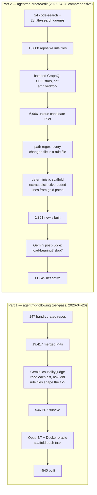

# agentsmd-rl

A benchmark and RL training pipeline for AI coding agents that work with **agent rule files** — `CLAUDE.md`, `AGENTS.md`, `SKILL.md`, `.cursor/rules/*`, `.claude/skills/*` and friends. These are the markdown files repos check in alongside their code to tell coding agents how to behave.

**The benchmark has two parts**, each testing a different skill:

| | What the agent does | What we measure | Corpus | Tasks |
|---|---|---|---|---|
| **Part 1 — agentmd-following** | Reads the repo's rule files, then writes code to fix a bug | Does the code follow the conventions the rule files document? (e.g. "use snake_case", "no wildcard imports", "always add a /api/v2 prefix") | `harbor_tasks/` | **609** |
| **Part 2 — agentmd-create/edit** | Writes or edits a rule file (creating new conventions, fixing a typo, adding a section) | Does the agent's output contain the distinctive lines the human author wrote in the gold PR? | `harbor_tasks_md_authoring/` | **2,482** |

Both parts come from real merged GitHub PRs (we don't synthesize anything). Both ship as Docker images on `ghcr.io/findalexli/agentsmd-rl/<task>:latest` and use the same scoring harness — a deterministic test plus optional LLM judges. Snapshot 2026-04-28: **3,172 active tasks total** — **2,482 for Part 2 (skill / markdown authoring)** and **609 for Part 1 (agentmd-following)**, plus a small hybrid corpus of 81.

A small third corpus, `harbor_tasks_agentmd_edits/` (81 tasks), holds PRs that do *both* — fix code AND update the rule file in the same diff — and tests whether agents can keep code and config in sync.

## Why this matters

A repo's rule files often contain 20–200 rules across nested directory levels. Some apply to your specific bug, some don't. An agent that blindly follows everything wastes time or breaks code; an agent that ignores them all writes against project conventions.

The research question:

> Can we train coding agents to **reason about which repository instructions apply** to a specific task, rather than blindly following all of them or ignoring them all?

The signal we exploit: when a human writes a PR, they make choices about which conventions to follow. That choice — visible in the gold diff — is the ground truth. Conventions the gold solution follows become **positive rubrics**. Conventions that look relevant but would have produced a worse solution if applied become **negative rubrics / distractors**.

Grounded in: [NoisyBench](https://arxiv.org/abs/2601.07226) (80% accuracy drop from hard distractors), [RARE](https://arxiv.org/abs/2505.18761) (rationale-aware reward), [SkillsBench](https://arxiv.org/abs/2602.12670) (skill selection with distractors), [GSM-DC](https://arxiv.org/abs/2505.18761) (distractor training improves out-of-distribution robustness). See [research/negative_rubrics_plan.md](research/negative_rubrics_plan.md) for the full research plan.

## How the two parts split the universe of PRs

Every merged PR we look at falls into one of four categories, depending on what its gold diff contains:

| What's in the gold diff | Goes to | Tests what |
|---|---|---|
| Edits a rule file (`CLAUDE.md`, `SKILL.md`, etc.) — possibly alongside code | **Part 2** (`harbor_tasks_md_authoring/`) | Can the agent author or update rule files? |
| Code only, but the fix encodes a rule that's documented in a rule file | **Part 1** (`harbor_tasks/`) | Can the agent recognise which documented conventions apply? |
| Code only, fully determined by the bug — rule files don't matter | Discarded | (nothing instruction-specific to test) |
| Platform-specific (iOS/Windows/GPU), >500-line refactor, no testable behaviour | Discarded | (can't fit into a Linux Docker oracle) |

A Gemini 3.1 Pro judge does the sorting. From the 2026-04-26 sweep over 13,046 candidate PRs: 1.6 % were Part-2 candidates (rule-file edits), 4.2 % were Part-1 candidates (code following a rule), and 94 % were discarded. Part 1 is conceptually the more important corpus — most agent-instruction-following happens inside the code, not in markdown edits — but Part 2 is much larger because we have a comprehensive enumeration of skill/agent-md authoring PRs across GitHub (see [§the comprehensive scout](#coverage-claim--2026-04-28-comprehensive-scout) below).

All tasks get the same four-track evaluation:
1. Programmatic fail-to-pass + pass-to-pass tests (the only one that contributes to the RL reward)
2. Config-edit comparison (Part 2 only) — Gemini compares gold rule-file edit vs agent's edit
3. Positive rubric — Gemini checks the agent followed the conventions documented in the rule files
4. Negative rubric / distractors — Gemini checks the agent did *not* apply rules that look relevant but would have made the fix worse

## How the corpus was built

Each part has its own scout-and-build pipeline, but both end with the same Docker-image-per-task output. The two pipelines differ in *what the gold diff contains* and therefore *how mechanically a task can be built from it*.



**Part 1's bottleneck is an LLM call on every candidate** — there's no syntactic way to tell, without reading the diff, whether a code-only fix encodes a documented convention. The Gemini judge classifies into A (edits a rule file → routes to Part 2), B (code follows a rule → keep), C (bug-determined, rule files don't matter → drop), or D (unscaffoldable on Linux/Docker → drop). 94 % of admitted PRs are class C — the dominant cut.

**Part 2's bottleneck moves earlier**: the path-regex filter "every changed file is a rule file" is free and drops mixed PRs upstream of any LLM call. The post-judge then reads the full gold patch and asks two specific questions — *load_bearing?* (would an agent reading vs ignoring this patch behave differently?) and *slop_score 0–10?* (concrete commands and version pins, vs. generic "this skill helps with X" boilerplate). It rejects auto-bot output ("Update AGENTS.md for commit X") and generic AI-authored skill prose; keeps anything with concrete behavioural assertions.

For the full per-stage table — what each filter checks, output count, drop rate — and the per-stage Mermaid funnels, see [`research/data_mining_pipeline.md`](research/data_mining_pipeline.md). What follows here is just the headline numbers and design rationale.

### Part 2's scout, in one paragraph

The comprehensive 2026-04-28 scout grew this corpus from 1,137 → **2,482 active** (**+1,345 net**) by combining two complementary discovery methods. Method A: 24 `gh api search/code` queries (subdivided by `path:` to break the 1,000-result cap) enumerate every repo on GitHub with a rule file in its default branch — **15,608 repos**. After ≥ 100 stars + not-archived + not-fork (batched GraphQL), the 846 healthy survivors yield **2,745 candidate PRs** that touch a rule-file path. Method B: 28 title queries with date-windowing recover **4,301 more PRs**. Merged + deduped: **6,966 unique candidates** in the 8-month window. The deterministic scaffolder built **1,351** of those; 6 hit the secret-pattern or unfetchable-SHA quarantine. Total infrastructure cost: ~2 hours wall and ~1,300 GraphQL calls — `taskforge/gh_graphql.py`'s batched alias queries make this affordable.

### What "reward = 1" actually means in Part 2

The canonical source of truth is **`solution/solve.sh`** — it contains the verbatim git patch from the merged PR. `eval_manifest.yaml`'s `config_edits.gold_added` mirrors it. `tests/test_outputs.py` is *derived from* `solve.sh` at scaffold time: we extract the 1–10 most distinctive added lines and emit `assert "<line>" in <file_text>` for each one. The literal strings in the test file aren't hand-coded — they're auto-extracted from the PR's diff. The agent's job is to faithfully reproduce the lines named in `instruction.md` (the human's PR description). A loosened "agent wrote SOMETHING about PR labels" test would pass both for a working solution AND a generic punt, losing all discrimination — so we keep the literal-string check by design.

### Quarantines (Part 2)

| Folder | Count | Reason |
|---|---:|---|
| `harbor_tasks_md_authoring_quarantine_quality/` | 266 | Gemini post-judge marked DELETE (bot-generated PRs, generic skill prose, broken-yaml manifests) |
| `harbor_tasks_md_authoring_quarantine_secrets/` | 5 | The PR added a real-looking API key inside the rule-file content; pre-commit hook would block |
| `harbor_tasks_md_authoring_quarantine_unfetchable/` | 3 | Base commit exists in GitHub API but `git fetch --depth=1 origin <sha>` fails (commit isn't reachable from a branch ref — typically PR-head-only) |

> **Pending re-judge.** The 2026-04-28 comprehensive-scout post-judge pass was killed because Gemini Flex was returning 58-second timeouts and ~21 % transient_failures that night. ~50 of the 1,351 new tasks got their full `md_quality.json`; the rest are default-active. Re-judging is queued — raw scout JSONLs are preserved under `scout_data/` so we don't have to re-fetch from GitHub.

## Repository Structure

```
claude-code-rl-w-tinker/    # RL training library (proxy + GRPO + Tinker API)
taskforge/                   # Task construction toolkit
  models.py                     # Pydantic: EvalManifest, Check, RubricRule, DistractorRule
  judge.py                      # Track 3: rubric convention compliance judge (Gemini)
  distractor_judge.py           # Track 4: distractor discrimination judge (Gemini)
  standalone_judge.py           # Self-contained judge for inside harbor containers
  e2b_worker.py                 # E2B sandbox pipeline: agent-chain architecture
  backends.py                   # Multi-backend LLM pool with rate limit handling
  gemini_rubric_constructor.py  # Structured output rubric generation + Kimi validation
  hierarchy_context.py          # Config hierarchy extractor (root → leaf AGENTS.md)
harbor_tasks/                # Part 1 — agentmd-following: code-only bug fixes (609 active)
harbor_tasks_md_authoring/   # Part 2 — agentmd-create/edit: rule-file edits (2,482 active)
harbor_tasks_agentmd_edits/  # Hybrid: code + rule-file edits in same PR (81 active)
scripts/
  run_agent_eval.py             # Agent eval runner (Track 1+3+4, pluggable backend)
  fix_task_toml.py              # Batch fix task.toml formatting issues
  deploy_judge.py               # Deploy standalone judge to all tasks
research/                    # Research docs, negative rubrics plan
.claude/skills/              # Claude Code skills for task scaffolding/validation
.claude/agents/              # Headless agent definitions for batch pipelines
```

### `claude-code-rl-w-tinker/` — Training Library

RL training using Claude Code as the agent harness and Tinker API for GPU compute.

```
Claude Code CLI (Harbor sandbox)
    │ Anthropic Messages API
    ▼
anthropic_proxy.py → captures (token_ids, logprobs) at generation time
    │
    ▼
Tinker SamplingClient → remote GPU (Qwen3.5, Kimi K2.5, etc.)
    │
    ▼
train.py → Harbor Trial → reward → GRPO → Tinker forward_backward
```

Key design: logprobs captured at generation time (not post-hoc), per-turn datums (AReaL "individual" style), Harbor as a black box. See [claude-code-rl-w-tinker/README.md](claude-code-rl-w-tinker/README.md) for architecture details.

### Task File Structure (both classes)

Each task directory contains:
- `instruction.md` — bug description (what the agent sees)
- `environment/Dockerfile` — repo cloned at pre-fix commit
- `tests/test.sh` → `test_outputs.py` — deterministic tests → `/logs/verifier/reward.txt` (binary: 0 or 1)
- `eval_manifest.yaml` — check declarations with source traceability + rubric rules
- `solution/solve.sh` — gold patch (idempotent)
- `task.toml` — Harbor metadata (difficulty, source PR, timeouts)
- `status.json` — validation provenance (per-node model/backend/time, history)

### `taskforge/` — Task Construction Toolkit

Python package for building and validating tasks:
- `models.py` — Pydantic models: `EvalManifest`, `Check`, `RubricRule`, `SourceRef`
- `config.py` — shared config patterns, `is_config_file()`, `extract_config_hunks()`
- `judge.py` — Track 3 rubric judge: evaluates agent code against repo conventions (Gemini 3.1 Pro)
- `distractor_judge.py` — Track 4 distractor judge: checks if agent incorrectly applied irrelevant rules
- `standalone_judge.py` — self-contained judge deployed inside harbor containers (no external deps)
- `e2b_worker.py` — E2B sandbox pipeline: agent-chain architecture (see below)
- `backends.py` — multi-backend LLM pool (MiniMax, GLM, Fireworks/Kimi) with auto-fallback, rate limit handling, and auto-resurrect
- `pipeline.py` — local parallel pipeline orchestrator (`claude -p` against tasks)
- `prompts/` — focused agent prompts (P2P enrich, improve tests, validate+fix)

### `research/`

- [rubric-reward-postmortem.md](research/rubric-reward-postmortem.md) — why LLM-generated rubrics failed as reward signal, trace-derived alternative
- [agent-manifest-confounding.md](research/agent-manifest-confounding.md) — agent configs as unmeasured confounders
- [test-design-audit.md](research/test-design-audit.md) — test.sh design audit (SWE-bench Verified critique)
- [benchmark_construction_log.md](research/benchmark_construction_log.md) — detailed build log (phases 1-12)
- [negative_rubrics_plan.md](research/negative_rubrics_plan.md) — distractor conventions research plan
- [pipeline-v2-plan.md](research/pipeline-v2-plan.md) — pipeline architecture optimization plan

## Pre-Built Docker Images

Task environments are distributed as pre-built images on GitHub Container Registry to avoid Docker Hub rate limits (100 pulls/6hr) and slow rebuilds.

```bash
# Pull a task image directly
docker pull ghcr.io/findalexli/agentsmd-rl/<task-name>:latest

# Harbor auto-pulls when docker_image is set in task.toml
harbor run -p harbor_tasks/<task> -a claude-code -m claude-opus-4-6 -y
```

Images are built via GitHub Actions (`gh workflow run push-images.yml`) — no local Docker builds needed. Each image is tagged with both a Dockerfile content hash (for cache-busting) and `:latest`. Harbor falls back to building from `environment/Dockerfile` if no pre-built image is configured.

Both task corpora are kept on GHCR:
- `harbor_tasks/` — code-fix tasks
- `harbor_tasks_md_authoring/` — markdown-authoring tasks (all 2,482 active tasks have images as of 2026-04-28; 99 % coverage at any given time, with a handful in flight after each scout)
- `harbor_tasks_agentmd_edits/` — code + config edit tasks (Track 2)

All Dockerfiles use shallow clone (`git fetch --depth=1 origin <SHA>`) for fast builds and small images.

| Registry | Why |
|----------|-----|
| **ghcr.io** (chosen) | Free for public packages, no pull rate limits, native GitHub Actions auth |
| Docker Hub | 100 pulls/6hr unauthenticated — breaks parallel eval runs |
| ECR Public | 50 GB free storage, too small for 400+ images |

See `scripts/push_images.py` for the build+push script and `.github/workflows/push-images.yml` for the CI workflow.

## Running Tasks

Requires [Harbor](https://github.com/laude-institute/harbor):

```bash
# Run a single task (all 4 tracks — programmatic + LLM judge)
harbor run -p harbor_tasks/<task> -a claude-code -m claude-opus-4-6 -e e2b -y

# Results in: <job-dir>/verifier/
#   reward.txt           — Track 1: binary 0/1 (programmatic tests)
#   agent.diff           — agent's code changes
#   track3_rubric.json   — Track 3: rubric convention compliance (Gemini)
#   track4_distractors.json — Track 4: distractor discrimination (Gemini)
```

### Agent Eval Runner (batch)

```bash
# Run N tasks with pluggable backend and 3-track scoring
.venv/bin/python scripts/run_agent_eval.py \
    --tasks tasks.txt \
    --out results.jsonl \
    --concurrency 4 \
    --backend anthropic \   # anthropic | minimax | glm
    --env e2b \
    --timeout 2400

# Outputs per-task JSONL + summary.json with pass rates
```

## Eval Results (April 18 2026)

### Opus 4.7 Baseline (10 tasks)

10 tier-A tasks from 10 different repos, evaluated on E2B with full 4-track scoring.

| Task | T1 (tests) | T3 (rubric) | T4 (distractors) | Time | Repo |
|------|-----------|-------------|-------------------|------|------|
| areal-data-proxy-batch-endpoint | **1** | 9/11 | 4/4 | 2.6m | inclusionAI/AReaL |
| sglang-diffusion-dtype-log-aggregation | 0 | 2/2 | 4/4 | 5.7m | sgl-project/sglang |
| clickhouse-cidb-secrets-refactor | 0 | 3/3 | 2/2 | 8.1m | ClickHouse/ClickHouse |
| playwright-mcp-press-enter-auto-snapshot | 0 | 0/3 | 5/5 | 8.3m | microsoft/playwright |
| vllm-rocm-uv-curl-failure | **1** | 3/3 | 2/2 | 10.7m | vllm-project/vllm |
| mimir-add-splitfile-claude-code-skill | 0 | 4/10 | 2/2 | 14.0m | grafana/mimir |
| nextjs-pr-status-reply-resolve | **1** | 6/6 | 2/2 | 14.6m | vercel/next.js |
| workers-sdk-ai-search-type-generation | 0 | 9/10 | 6/6 | 21.6m | cloudflare/workers-sdk |

### Kimi K2.5 vs Opus 4.7 (8 overlapping tasks)

| Metric | Kimi K2.5 (Fireworks) | Opus 4.7 (Anthropic) |
|--------|----------------------|---------------------|
| **Track 1 (solve rate)** | 1/8 (12.5%) | 3/8 (37.5%) |
| **Track 3 (rubric)** | 25/38 (65.8%) | 36/51 (70.6%) |
| **Track 4 (distractors)** | 21/21 (100%) | 27/27 (100%) |
| **Avg time** | 484s | 642s |

Key: Opus solves 3x more tasks. Kimi is 25% faster but produces no diff on the hardest task. Track 4 identical at 100% for both models.

### Known Limitations: Track 3/4 Quality (see audit below)

**Track 1 (programmatic tests) is the primary discriminator.** Tracks 3 and 4 have known quality issues that make their scores unreliable signals — see "Rubric Quality Audit" section.

## Research Insights

Key findings from building this benchmark, documented in `research/`:

### LLM-generated rubrics don't work as reward signal

We tried three generators (Gemini, Kimi validation loop, Codex/GPT-5.4) to extract convention-following rubrics from agent config files. After generating 3,489 rules across 914 tasks and running a controlled 8-task evaluation, we found that **rubric scores do not discriminate between agents that solve the task and agents that don't**. ~50% of rules are tautological (describe what any correct solution does), and the core problem — distinguishing "pre-existing convention" from "description of the gold solution" — is irreducibly circular when deriving rules from the gold diff.

**Decision:** Binary outcome reward only. Rubrics demoted to monitoring/diagnostics.
**Future direction:** Derive rubrics from multi-agent trace diffs (what do successful agents do that failed ones don't?) instead of from the gold diff.
[Full analysis →](research/rubric-reward-postmortem.md)

### Agent instruction files are unmeasured confounders

Repos with CLAUDE.md/AGENTS.md files are systematically different from repos without them — more active, better documented, stricter CI. This means any performance difference between "tasks from config repos" and "tasks from non-config repos" could be explained by repo quality, not agent instruction awareness. We control for this by sourcing ALL tasks from config repos and varying only the instructions shown to the agent.
[Full analysis →](research/agent-manifest-confounding.md)

### SWE-bench-style test design is fragile

Following [OpenAI's critique of SWE-bench Verified](https://openai.com/index/why-we-no-longer-evaluate-swe-bench-verified/), we audited test design across 100+ tasks and found that structural assertions (exact variable names, AST patterns, grep for specific strings) reject valid alternative solutions. Our design principle: test BEHAVIOR not STRUCTURE. Structural checks are supplementary only (<=40% weight), and every fail-to-pass test must invoke the actual code path.
[Full analysis →](research/test-design-audit.md)

### Generating hard, non-trivial rubrics is an open problem

Even after fixing extraction accuracy (Codex achieves 100% line accuracy), the fundamental challenge remains: most repo conventions are either trivially followed by any competent agent (formatting, imports) or too ambiguous to judge automatically (architecture decisions). The ~4% of rules that genuinely test convention *discrimination* — where an agent must choose between competing conventions — are the ones that matter for RL training, and we don't yet have a reliable way to generate them at scale.

## Training

```bash
export TINKER_API_KEY=tml-...

python claude-code-rl-w-tinker/train.py \
    --model_name Qwen/Qwen3.5-35B-A3B \
    --agent_name claude-code \
    --environment_type docker \
    --max_turns 200 \
    --groups_per_batch 4 \
    --group_size 4
```

## Evaluation Architecture

### Scoring: Binary

All checks must pass → reward `1`. Any check fails → reward `0`.
This matches every major SWE benchmark (SWE-bench, Terminal Bench, SWE-smith, R2E-Gym).

### Check types

| Type | What | Example |
|------|------|---------|
| `fail_to_pass` | Must fail on base commit, pass after fix | Bug reproduction test |
| `pass_to_pass` | Must pass before and after fix | Regression test |

### Four-track evaluation

| Track | What | Method | Role | Coverage |
|-------|------|--------|------|----------|
| 1. Code correctness | Did the agent fix the bug? | `test.sh` → nop=0, gold=1 | **Reward signal** | All Part-1 tasks |
| 2. Config edits | Did the agent update rule files correctly? | Gold diff vs agent diff (Gemini semantic comparison) | Monitoring | Part-2 + hybrid only |
| 3. Positive rubric | Does the agent follow relevant conventions? | Gemini 3.1 Pro judges diff vs rubric rules | Monitoring | 914 tasks (3,489 rules) |
| 4. Distractors | Does the agent IGNORE irrelevant conventions? | Gemini checks agent didn't apply collision rules | Monitoring | 646 tasks (1,710 rules) |

**Only Track 1 contributes to the RL reward.** Tracks 2-4 are logged for diagnostics and model comparison but do not affect training gradients. See [Research Insights](#research-insights) for why.

Tracks 3 and 4 run automatically inside the harbor container via `standalone_judge.py` (deployed to 952 tasks). No external wrapper needed — `harbor run` produces all tracks.

**Track 4 collision types** (1,710 distractors across 646 tasks):
- `scope_ambiguity` (44%): rule's applicability is genuinely ambiguous for this PR
- `meta_confusion` (22%): writing ABOUT a pattern vs applying it
- `architecture_boundary` (15%): applying a pattern beyond its intended scope
- `rule_conflict` (13%): two valid rules conflict, agent must choose
- `would_cause_bug` (6%): following the rule introduces an error

### Design principles

Following [OpenAI's critique of SWE-bench Verified](https://openai.com/index/why-we-no-longer-evaluate-swe-bench-verified/):

- **No narrow tests** that enforce specific variable names or API choices from the gold patch
- Accept multiple valid implementations — test BEHAVIOR, not STRUCTURE
- Structural AST checks supplementary only (<=40% weight)

## Task Construction Pipeline

We run two simple pipelines, both inside an E2B Firecracker microVM with Docker access. **Each pipeline uses one `claude -p` agent call** — the agent does its own iteration internally (write code → run Docker → verify → adjust) instead of being orchestrated across multiple separate calls.

### Pipeline 1: Repair (existing task → cleaned task)

For tasks already in `harbor_tasks/` that have quality issues (broken oracle, weak tests, leaky instructions). Used to clean the active pool.

```
[ Programmatic lint ] → [ One Opus call: fix tests + instruction + run Docker oracle + write verdict ]
```

- Programmatic lint (no LLM, ~2s) flags issues like tautological tests, unpinned deps, `pip install` at test time. Output is fed to the Opus prompt as a "what's wrong" hint.
- The Opus agent reads `quality.json`, edits `test_outputs.py` / `instruction.md` / `eval_manifest.yaml`, runs `nop=0/gold=1` Docker validation itself, and writes either `{"fixed": true, "nop_reward": 0, "gold_reward": 1}` or `{"abandoned": true, "reason": "..."}` to `reconcile_status.json`. We trust the agent's verdict and download.
- Empirically: ~85–90% real pass rate, 15–25 min wall per task.

```bash
.venv/bin/python scripts/validate_batch.py \
    --task-file queue.txt \
    --start-at oneshot_repair \
    --concurrency 10
```

### Pipeline 2: Scaffold (new PR → new task)

For PRs in the candidate placeholder pool that pass the causality judge. (Currently the same `claude -p` repair pattern; a dedicated `oneshot_scaffold` mode is planned that internalizes the lint rules + Docker oracle in a single agent call.)

### Why one-call pipelines

Earlier versions of this repo had a 4–6 node chain (scaffold → enrich → improve → validate → judge → reconcile → tests-rewrite). Each node spun a fresh sandbox session, each hit rate limits independently, and a redundant validate node frequently overwrote the agent's correct verdict. Collapsing to a single call makes the pipeline ~5× more accurate and substantially easier to reason about.

The legacy multi-node modes (`fix_quality`, `validate`, `judge`) still exist in `taskforge/e2b_worker.py` and are reachable via `--start-at <mode>`, but `oneshot_repair` is the supported default.

### Backend Pool

LLM calls inside sandboxes route through a multi-backend pool with automatic fallback and rate limit handling:

```
MiniMax M2.7    → 50 concurrent slots (primary, sustained 15 concurrent for 11+ hours)
GLM-5.1         → 30 concurrent slots (secondary)
Fireworks/Kimi  → 1-2 concurrent slots (per-account TPM limit, thinking tokens dominate)
```

**Rate limit handling** (redesigned Apr 18):
- Cooldown: 10s * 2^n, cap 120s (was 30s * 2^n, cap 600s)
- Auto-suspend backend after 20 consecutive 429s, auto-resurrect after 300s
- Single-shot `claude -p` calls (removed inner 4-attempt retry loop that caused 120x amplification)
- Staggered worker startup: `worker_id * 5s + random(0,3)` to prevent burst
- Re-enqueue delay: 30s * 2^n backoff (was immediate), max 4 retries

### Local Pipeline (legacy)

```bash
# Scout PRs from repos with agent configs
python -m taskforge.scout scout --agentmd --repos-file scouted_repos.jsonl --output scouted.jsonl

# Scaffold tasks (via Claude Code agent)
python -m taskforge.pipeline scaffold-from-prs --input scouted.jsonl --workers 8 --pool
```

## Differentiation from Existing Work

| What | Who Does It | Do We? |
|------|------------|--------|
| Mine PRs → Docker environments | SWE-rebench, SWE-Universe, SWE-Next | Yes (standard) |
| Fail-to-pass test verification | SWE-bench (all variants) | Yes (standard) |
| RL training from PR environments | SWE-Gym, SWE-RL, DeepSWE | Yes |
| **Filter for repos with agent configs** | **Nobody** | **Yes (novel)** |
| **4-track eval: code + config + rubric + distractors** | **Nobody** | **Yes (novel)** |
| **Negative rubrics (distractor discrimination)** | **Nobody** | **Yes (novel, 1,710 distractors)** |
| **Hierarchical config context extraction** | **Nobody** | **Yes (novel)** |
| **Self-contained LLM judge in test harness** | **Nobody** | **Yes (novel, Gemini structured output inside harbor)** |

## Status (2026-04-28)

- **Part 1 (`harbor_tasks/`)** — agentmd-following: **609 active**. ≈ 93 % Docker oracle pass. Last scout pass 2026-04-26.
- **Part 2 (`harbor_tasks_md_authoring/`)** — agentmd-create/edit: **2,482 active**. Comprehensive scout completed overnight 2026-04-28; +1,345 net new tasks (1,351 newly built minus 6 quarantined); 10/10 random Docker smoke builds passed; pushed to GHCR via `push-images.yml`.
- **In flight**: post-judge re-run for the 1,351 newly-built Part-2 tasks (the original pass was killed mid-run because Gemini Flex was returning 58-second timeouts and ~21 % `transient_failures`).

See [research/scouting_report_2026_04_26.md](research/scouting_report_2026_04_26.md) for Part 1's last scout report (per-repo yields, classifier comparison) and [research/data_mining_pipeline.md](research/data_mining_pipeline.md) for the full Part 2 comprehensive-scout architecture.

### Monitoring: Convention-Following Rubrics (Tracks 3 & 4)

Rubric and distractor rules are generated for diagnostics and model comparison, not reward. They help understand *how* agents solve tasks but don't reliably discriminate solved vs unsolved (see [postmortem](research/rubric-reward-postmortem.md)).

**Coverage (across 914 tasks with rubric data):**
- 3,489 positive rubric rules (3.8/task avg) — conventions from CLAUDE.md, AGENTS.md, SKILL.md
- 1,710 negative rubric / distractors (2.6/task avg) — collision-typed and severity-graded
- 952 tasks with self-contained LLM judge in test.sh (Gemini structured output)

**Distractor collision types:**

| Type | Count | % | Description |
|------|-------|---|-------------|
| `scope_ambiguity` | 273 | 49% | Rule's applicability is genuinely ambiguous for this PR |
| `architecture_boundary` | 95 | 17% | Applying a pattern beyond its intended scope |
| `meta_confusion` | 91 | 16% | Writing ABOUT a pattern vs applying it |
| `rule_conflict` | 70 | 13% | Two valid rules conflict, agent must choose |
| `would_cause_bug` | 21 | 4% | Following the rule introduces an error |

**Evaluation infrastructure:**
- Rubric generation via Gemini 3.1 Pro structured output + Codex CLI extraction (100% line accuracy)
- Rubric validation via Kimi→Gemini→Kimi cross-validation loop
- Standalone LLM judge deployed into 952 tasks — `harbor run` produces all 4 tracks without external wrappers
- Agent eval runner (`scripts/run_agent_eval.py`) for batch evaluation with pluggable backends

### Rubric Quality Audit (April 19 2026)

Deep audit of all rubric and distractor rules across 8 eval tasks revealed systemic quality issues. **Track 3 (rubric) scores are currently noise, not signal. Track 4 (distractors) has a ceiling effect — both Opus and Kimi score 100%.**

**Smoking gun**: Kimi K2.5 scored 6/6 rubric on `nextjs-pr-status-reply-resolve` WITHOUT solving the task (T1=0). The rubric doesn't test convention-following — it tests whether the agent attempted the task at all.

**Five systemic pathologies (across 3,487 rubric rules):**

| Problem | Frequency | Description |
|---------|-----------|-------------|
| **Tautological rules** | ~50% | Restate what instruction.md says or what any correct solution does automatically |
| **Duplicate rules** | ~17% | Same rule 2-4x with slightly different phrasing (e.g., wildcard-import 4x in one task) |
| **Redundant with Track 1** | ~15% | Already tested by programmatic checks in test.sh |
| **Wrong line numbers** | ~30% | Source lines off by 3-16 lines; files exist (100% accurate) but cited lines contain unrelated content |
| **Wrong-scope distractors** | ~60% | Pulled from unrelated agent files (e.g., test-generator rules for framework source code) |

**Quantified field coverage (3,487 rubric rules across 914 manifests):**

| Field | Coverage |
|-------|----------|
| `source.path` | 73% |
| `source.lines` | 68% |
| `evidence` | 35% |
| `source_text` | 8% |
| `category` | 37% |

Distractors are well-formed (99%+ field coverage) but mostly implausible — no frontier model follows them.

**Root cause**: The rubric generation prompt asks "find rules the gold solution follows" without distinguishing pre-existing conventions from descriptions of what the PR does. Gemini correctly identifies that the gold uses `Info().get_secret()` and reports it as a "convention" — but it's just the task instruction restated.

**Decision: outcome-only reward, rubrics as monitoring.**

We attempted multiple fixes — Codex/GPT-5.4 extraction (fixed line drift, 100% accuracy), Kimi→Gemini→Kimi validation loop (caught 25-75% of hallucinations), anti-tautology gates (caught obvious cases). These improved precision but didn't solve the core problem: tautological rules are *technically correct*, they just don't test anything meaningful. The boundary between "convention the solution follows" and "description of the solution" is irreducibly fuzzy.

Track 1 (binary outcome from programmatic tests) is the sole RL reward signal. Tracks 3 and 4 are logged for diagnostics — useful for understanding *how* an agent solved a task, not *whether* it did. See [research/rubric-reward-postmortem.md](research/rubric-reward-postmortem.md) for the full analysis and future direction (trace-derived rubrics from multi-agent runs).

**Pipeline improvements (Apr 2026):**
- Retry stack redesign: eliminated 120x retry amplification (was 10×4×3 calls per rate limit)
- Multi-backend pool: MiniMax (primary) + GLM (secondary) with auto-fallback and auto-resurrect
- Staggered worker startup prevents burst rate limiting
- task.toml batch fixer: all 1,136 task configs now parse cleanly (fixed 222 broken files)
- Structural test audit: removed syntax-overfitting assertions (if/else keyword checks, exact variable assignments)

E2B agent-chain pipeline operational. RL training loop verified end-to-end with Qwen3.5-35B-A3B on Harbor.
