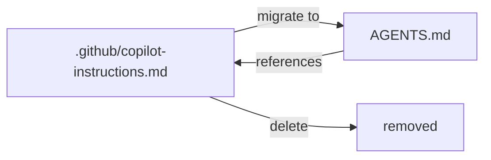

# Migrate GitHub Copilot instructions to AGENTS.md

Source: [ChatGPTBox-dev/chatGPTBox#891](https://github.com/ChatGPTBox-dev/chatGPTBox/pull/891)

This task is a **markdown_authoring** task. The repository's agent-instruction file(s)
need to be updated. Read the existing content and add or modify the rules so that
the file matches the intent described below.

## Files to update

- `.github/copilot-instructions.md`
- `AGENTS.md`
- `AGENTS.md`

## What to add / change

### **User description**
Copilot coding agent now supports AGENTS.md custom instructions, as more coding agents support it. Migrating from GitHub Copilot's custom instructions file to AGENTS.md will help developers leverage more and different coding agents than just GitHub Copilot.

Reference:
- https://agents.md/
- https://github.blog/changelog/2025-08-28-copilot-coding-agent-now-supports-agents-md-custom-instructions/

___

### **PR Type**
Documentation

___

### **Description**
- Migrate GitHub Copilot instructions to AGENTS.md format

- Remove existing copilot-instructions.md file completely

- Create AGENTS.md file referencing original instructions

- Support multiple coding agents beyond GitHub Copilot

___

### Diagram Walkthrough

 
<h3> File Walkthrough</h3>

<table><thead><tr><th></th><th align="left">Relevant files</th></tr></thead><tbody><tr><td><strong>Documentation</strong></td><td><table>
<tr>
  <td>
    

      
<strong>copilot-instructions.md</strong><dd><code>Remove GitHub Copilot instructions file</code>&nbsp; &nbsp; &nbsp; &nbsp; &nbsp; &nbsp; &nbsp; &nbsp; &nbsp; &nbsp; &nbsp; &nbsp; &nbsp; &nbsp; &nbsp; &nbsp; &nbsp; &nbsp; </dd>

.github/copilot-instructions.md

<ul><li>Complete removal of GitHub Copilot specific instructions f

## Acceptance

The grader runs `pytest /tests/test_outputs.py` which checks that distinctive
literal strings from the intended update are present in the target file(s).
You do not need to write any code outside of the markdown file(s).
