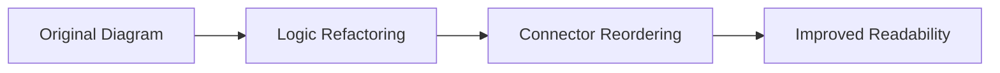

# Update CLAUDE.md

Source: [lst97/claude-code-sub-agents#2](https://github.com/lst97/claude-code-sub-agents/pull/2)

This task is a **markdown_authoring** task. The repository's agent-instruction file(s)
need to be updated. Read the existing content and add or modify the rules so that
the file matches the intent described below.

## Files to update

- `CLAUDE.md`

## What to add / change

### **User description**
# Summary

Tidy up mermaid diagrams.

## Changes

- Refactor double negatives
- Reorder connectors to avoid overlap

___

### **PR Type**
Documentation

___

### **Description**
- Refactor mermaid diagram logic flow conditions

- Reorder diagram connectors to prevent visual overlap

- Improve diagram readability and logical flow

___

### Diagram Walkthrough

 
<h3> File Walkthrough</h3>

<table><thead><tr><th></th><th align="left">Relevant files</th></tr></thead><tbody><tr><td><strong>Documentation</strong></td><td><table>
<tr>
  <td>
    

      
<strong>CLAUDE.md</strong><dd><code>Refactor mermaid diagram logic and layout</code>&nbsp; &nbsp; &nbsp; &nbsp; &nbsp; &nbsp; &nbsp; &nbsp; &nbsp; &nbsp; &nbsp; &nbsp; &nbsp; &nbsp; &nbsp; &nbsp; </dd>

CLAUDE.md

<ul><li>Changed "non-trivial" condition to "trivial" with inverted logic flow  <li> Reordered YES/NO branches in decision trees for better visual layout  <li> Adjusted connector positioning to prevent diagram overlap</ul>

  </td>
  <td><a href="https://github.com/lst97/claude-code-sub-agents/pull/2/files#diff-6ebdb617a8104a7756d0cf36578ab01103dc9f07e4dc6feb751296b9c402faf7">+5/-5</a>&nbsp; &nbsp; &nbsp; </td>

</tr>
</table></td></tr></tr></tbody></table>

</det

## Acceptance

The grader runs `pytest /tests/test_outputs.py` which checks that distinctive
literal strings from the intended update are present in the target file(s).
You do not need to write any code outside of the markdown file(s).
