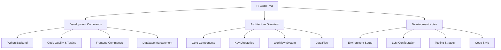

# Add CLAUDE.md

Source: [Skyvern-AI/skyvern#3525](https://github.com/Skyvern-AI/skyvern/pull/3525)

This task is a **markdown_authoring** task. The repository's agent-instruction file(s)
need to be updated. Read the existing content and add or modify the rules so that
the file matches the intent described below.

## Files to update

- `CLAUDE.md`

## What to add / change

---

📚 This PR adds a comprehensive CLAUDE.md documentation file that provides Claude AI with essential guidance for working with the Skyvern codebase, including development commands, architecture overview, and coding standards.

🔍 <strong>Detailed Analysis</strong>

### Key Changes
- **Documentation Addition**: Creates a new CLAUDE.md file specifically designed to help Claude AI understand and work with the Skyvern repository
- **Development Commands**: Comprehensive list of commands for Python backend, frontend, testing, and database management
- **Architecture Documentation**: Detailed overview of Skyvern's multi-agent browser automation platform structure
- **Development Guidelines**: Environment setup, LLM configuration, testing strategy, and code style standards

### Technical Implementation

### Impact
- **AI Assistant Integration**: Enables Claude AI to better understand the codebase structure and provide more accurate assistance

## Acceptance

The grader runs `pytest /tests/test_outputs.py` which checks that distinctive
literal strings from the intended update are present in the target file(s).
You do not need to write any code outside of the markdown file(s).
