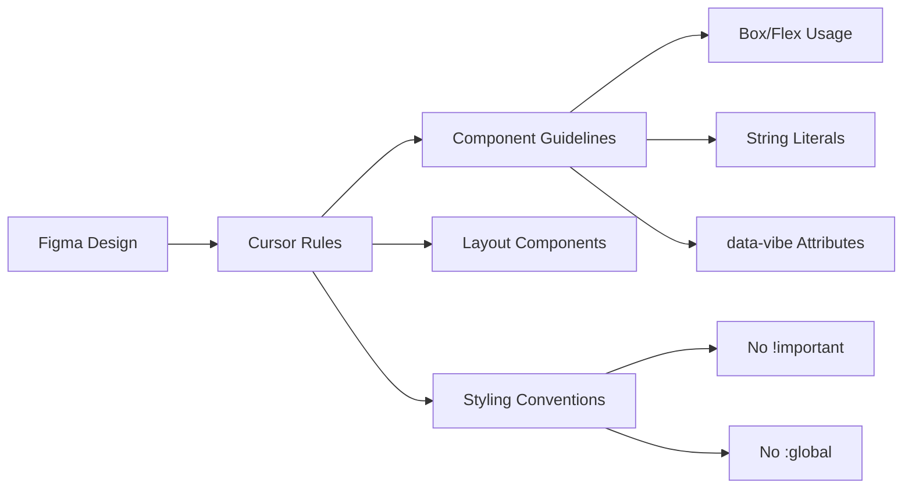

# docs: add new Cursor rules and improve existing rules to enhance support figma-to-vibe workflow

Source: [mondaycom/vibe#3078](https://github.com/mondaycom/vibe/pull/3078)

This task is a **markdown_authoring** task. The repository's agent-instruction file(s)
need to be updated. Read the existing content and add or modify the rules so that
the file matches the intent described below.

## Files to update

- `.cursor/rules/base-components.mdc`
- `.cursor/rules/component-internal-structure.mdc`
- `.cursor/rules/file-structures.mdc`
- `.cursor/rules/layout-components.mdc`
- `.cursor/rules/naming-conventions.mdc`
- `.cursor/rules/new-component-implementation.mdc`
- `.cursor/rules/storybook-stories.mdc`
- `.cursor/rules/styling-conventions.mdc`

## What to add / change

### **User description**
https://monday.monday.com/boards/3532714909/pulses/9839254896

___

### **PR Type**
Documentation

___

### **Description**
- Add comprehensive Cursor rules for Figma-to-Vibe workflow

- Enhance component styling and layout guidelines

- Update file structure and testing conventions

- Add mandatory component identification requirements

___

### Diagram Walkthrough

 
<h3> File Walkthrough</h3>

<table><thead><tr><th></th><th align="left">Relevant files</th></tr></thead><tbody><tr><td><strong>Documentation</strong></td><td><table>
<tr>
  <td>
    

      
<strong>base-components.mdc</strong><dd><code>Add className prop styling guideline</code>&nbsp; &nbsp; &nbsp; &nbsp; &nbsp; &nbsp; &nbsp; &nbsp; &nbsp; &nbsp; &nbsp; &nbsp; &nbsp; &nbsp; &nbsp; &nbsp; &nbsp; &nbsp; &nbsp; &nbsp; &nbsp; </dd>

.cursor/rules/base-components.mdc

<ul><li>Add guideline for using <code>className</code> prop instead of CSS selectors when  styling base components</ul>

  </td>
  <td><a href="https://github.com/mondaycom/vibe/pull/3078/files#diff-153962f90aee2df762b59877f7256636f24868c16e7

## Acceptance

The grader runs `pytest /tests/test_outputs.py` which checks that distinctive
literal strings from the intended update are present in the target file(s).
You do not need to write any code outside of the markdown file(s).
