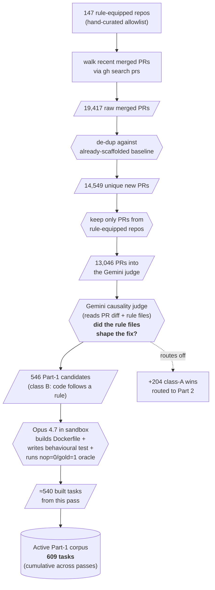
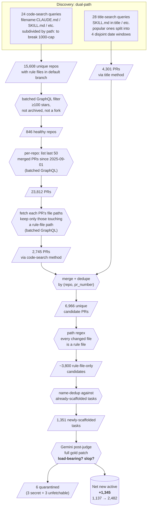

# Data Construction Methods

How we turn merged GitHub PRs into runnable benchmark tasks. Snapshot 2026-04-28: **3,172 active tasks** across two main corpora plus a small hybrid one — **2,482 in Part 2 (skill / markdown authoring)** and **609 in Part 1 (agentmd-following)** — all shipped as Docker images on `ghcr.io/findalexli/agentsmd-rl/<task>:latest`.

The benchmark has two parts. They differ in what the gold PR diff contains, and therefore in how mechanically a task can be built from it. A "rule file" throughout this doc means one of `CLAUDE.md`, `AGENTS.md`, `SKILL.md`, `.cursor/rules/*`, `.claude/{rules,skills,agents}/*.md`, `.github/copilot-instructions.md`, and a few similar paths — the markdown files repos check in to tell coding agents how to behave.

| | Folder | Active | What the agent does | What's in the gold diff | How tasks are built |
|---|---|---:|---|---|---|
| **Part 1 — agentmd-following** | `harbor_tasks/` | **609** | Reads the rule files, then writes code to fix a bug | Code-only fix that *follows a convention documented in a rule file* | Claude Opus 4.7 in an isolated sandbox (each task needs a custom behavioural test) |
| **Part 2 — agentmd-create/edit** | `harbor_tasks_md_authoring/` | **2,482** | Writes or edits a rule file | Only rule files (no code change) | Deterministic script: clone, apply the gold patch (`solution/solve.sh`), then derive `tests/test_outputs.py` by extracting the most distinctive added lines from the patch |
| Hybrid (smaller corpus) | `harbor_tasks_agentmd_edits/` | 81 | Both — fix code AND update the rule file in the same diff | Code + rule-file edits | Same Opus-in-sandbox pipeline as Part 1, plus an extra Track-2 check on the rule-file edit |

## What we keep, what we drop

A merged PR is useful only when its gold diff is *shaped by* the rule files — i.e. the diff would look materially different if those files had been absent. Every PR we look at falls into one of four categories:

| Gold diff content | Goes to | Why |
|---|---|---|
| Edits a rule file (possibly alongside code) | Part 2 | Tests rule-file authoring |
| Code-only, fix encodes a rule documented in a rule file | Part 1 | Tests rule-file following |
| Code-only, fix is determined by the bug — rule files don't matter | Drop | Nothing rule-specific to test |
| Platform-specific (iOS/Windows/GPU), > 500-line refactor, no testable behaviour | Drop | Can't fit a Linux Docker oracle |

A Gemini 3.1 Pro judge does the sorting for Part 1's pipeline. Part 2's pipeline uses a regex on file paths first (every changed file must be a rule file — that's free and rules out 96 % of candidates) and then sends the survivors through a Gemini judge that reads the full gold patch.

## Coverage claim — 2026-04-28 comprehensive scout

For Part 2, we believe the active corpus reflects a near-exhaustive census of skill / rule-file authoring PRs from production-grade public repos. The scout uses two complementary discovery methods:

**Method A — code search.** `gh api search/code` with `filename:` / `path:` queries (24 of them, e.g. `filename:SKILL.md path:.claude/skills/`, `filename:.cursorrules`, `extension:mdc`) lists every repo that has a rule file in its default branch. GitHub caps each query at 1,000 results, so we subdivide by path/extension to break the cap. Result: **15,608 unique repos**. Filter to ≥ 100 stars, not archived, not a fork (batched GraphQL — 312 calls): **846 healthy repos**. For each, enumerate the last 50 merged PRs since 2025-09-01 (batched GraphQL, ~17 calls), then fetch each PR's file paths and keep the ones touching a rule-file path: **2,745 PRs**.

**Method B — date-windowed title search.** The traditional approach: search for `is:pr is:merged SKILL.md in:title`, etc. Each query also caps at 1,000 results, so for popular queries we split the 8-month merge window into four disjoint date ranges and run each separately — that recovers another 3× past the cap. 28 base queries × variable windowing produced **4,301 PRs**.

**Merged + deduped by `(repo, pr_number)`: 6,966 unique candidate PRs in the active window.** The deterministic scaffolder built **1,351 new tasks**; after secret-pattern + unfetchable-SHA quarantine the active corpus settled at **2,482**.

The two methods miss different subsets. Method A misses PRs in repos whose rule file was added then later deleted. Method B misses PRs whose title doesn't quote the rule file (`feat: add new skill` that touches `skills/foo/SKILL.md` but never says `SKILL.md` in the title — sampled cross-repo PRs suggest about 40 % of skill-authoring work falls in this bucket). Combined, the residual blind spots are repos that match neither — a small fraction of the universe.

Recall gaps that remain are intentional:
- < 100-star repos (production-quality floor)
- PRs older than 2025-09-01 (deliberate 8-month window)
- Repos archived or made private after the index ran
- Forks (convention edits in forks rarely reflect upstream practice)

The infrastructure that makes this affordable: `taskforge/gh_graphql.py` provides batched alias queries for repo metadata, PR enumeration, file paths, and full repo bundles — each replaces N REST calls with N/50 GraphQL aliased calls. Without it, the per-repo PR enumeration alone (15,608 repos) would have been ~28 K REST calls (5K/hr budget = 6 hours blocked on rate limits). With it, the whole comprehensive scout runs in ~2 hours wall clock and ~1,300 GraphQL calls. We can refresh the corpus on demand.

## The pipelines, end to end

The two parts have different filtering structures because the gold-diff content drives what's possible. **Part 1 needs an LLM to read every candidate's diff** and decide if a rule influenced the fix — there's no syntactic short-circuit. **Part 2 has a free path-regex filter** that drops most candidates before any LLM call, so the LLM only judges the small surviving set.

What follows is the funnel for each part, in two views: a Mermaid flowchart of the architecture, and a stage-by-stage table that says exactly what each filter checks for and how much it drops.

### Part 1 — agentmd-following



| Stage | Inputs | What it checks | Output count | Drop rate |
|---|---|---|---:|---:|
| Discovery | – | A maintained allowlist of repos that contain `CLAUDE.md` / `AGENTS.md` / `SKILL.md` / `.cursor/rules`. New repos are added by hand after a quick eyeball. | **147 repos** | – |
| PR walk | 147 repos | `gh search prs --is-merged --updated >=…`. No filter — we want every recent merged PR. | **19,417 PRs** | – |
| De-dup | 19,417 PRs | Drop PRs that already have a task directory (slug name match). Free, mechanical. | 14,549 PRs | 25 % |
| Repo allowlist re-check | 14,549 PRs | Re-confirm the PR is in a repo that still has at least one rule file at the merge SHA (some PRs come from forks or mid-rebase commits). | 13,046 PRs | 8 % |
| **Gemini causality judge** *(LLM, dominant cut)* | PR title + body + full diff + the repo's rule files | One Gemini call per PR. The model classifies into A / B / C / D: <ul><li>**A** — gold edits a rule file → route to Part 2</li><li>**B** — code-only fix that *follows a documented rule* → keep for Part 1</li><li>**C** — code-only fix fully determined by the bug, rule files are decorative → drop</li><li>**D** — platform-specific (iOS / Windows / GPU) or > 500-line refactor — can't fit a Linux Docker oracle → drop</li></ul> The judge is told to err toward C/D when ambiguous; we'd rather lose a borderline B than admit a C. | A=204, B=546, C=10,398, D=1,896 | **94 %** |
| Opus build + Docker oracle | 546 class-B PRs | Opus 4.7 in an E2B sandbox, given the PR diff and a scaffolding template, writes `environment/Dockerfile`, `solution/solve.sh`, `tests/test_outputs.py`, and `eval_manifest.yaml`, then runs `nop=0` (no fix → reward 0) and `gold=1` (apply gold patch → reward 1). Tasks where the oracle fails are dropped. | ≈540 built | ~28 % |

Per-PR yield: **2.8 % per scout pass**. The dominant cut (94 %) is the Gemini causality judge — almost all merged PRs are bug fixes any agent could write without consulting any rule file. The remaining ~28 % oracle drop catches scaffolds where Opus chose a brittle test (e.g. depends on a network resource at test time) or got the patch slightly wrong.

### Part 2 — agentmd-create/edit (2026-04-28 comprehensive scout)



| Stage | Inputs | What it checks | Output count | Drop rate |
|---|---|---|---:|---:|
| Code-search discovery (Method A) | The whole of GitHub | 24 `gh api search/code` queries like `filename:CLAUDE.md`, `filename:SKILL.md path:.claude/skills/`, `extension:mdc path:.cursor/rules/`. GitHub caps each query at 1,000 results, so we subdivide by `path:` / `extension:` to spread the load. | **15,608 unique repos** | – |
| Star + archive filter | 15,608 repos | One batched GraphQL call per 50 repos. Keep ≥ 100 stars, drop archived, drop forks. | 846 repos | 95 % |
| PR enumeration | 846 repos | Per repo, list the 50 most recently merged PRs since 2025-09-01 (8-month window), batched GraphQL. | 23,812 PRs | – |
| File-paths fetch + rule-file filter | 23,812 PRs | Per PR, fetch the changed-files list (batched GraphQL), keep only PRs that touch at least one rule-file path. | 2,745 PRs | 88 % |
| Title-search discovery (Method B) | The whole of GitHub | 28 title queries like `is:pr is:merged SKILL.md in:title`. Popular queries (saturating the 1,000 cap) split into four disjoint date windows for ~4× more depth. | **4,301 PRs** | – |
| Merge + dedupe | 2,745 + 4,301 | Union by `(repo, pr_number)`. The two methods miss different subsets — Method A misses PRs in repos whose rule file was deleted; Method B misses PRs that don't quote the rule file in their title. Combined, the residual blind spot is small. | **6,966 unique** | – |
| Rule-file-only path filter *(free)* | 6,966 PRs | Every file path in the diff matches the rule-file regex. PRs that mix code and rule files route to Part 1 (the Opus pipeline can scaffold those; Part 2's verbatim-grep cannot). | ~3,800 PRs | ~45 % |
| Scaffolder de-dup | ~3,800 PRs | Drop PRs that already have a task directory (slug name collision with earlier scouts). | 1,351 newly built | – |
| **Gemini post-judge** *(LLM, partial)* | The full gold patch + the PR description | One Gemini call per scaffolded task. The model returns four structured fields: <ul><li>`load_bearing` — would an agent reading this gold patch behave differently than one ignoring it?</li><li>`research_relevant` — does the change carry a behavioural assertion an agent could either follow or violate?</li><li>`slop_score` (0–10) — 0 = concrete commands / paths / version pins, 10 = generic "this skill helps with X" boilerplate</li><li>`verdict` — HIGH / MEDIUM / LOW / DELETE, computed deterministically from the above</li></ul> Default to reject when in doubt. **Note**: the 2026-04-28 run was killed mid-pass when Gemini Flex started returning 58-second timeouts; ~50 of the 1,351 got their full judgement; re-judge is queued. | 1,345 net new active (after 6 quarantines) | (pending re-judge) |
| Quarantine | 1,351 built | 3 dirs contained API-key-shaped strings (Google-style 39-char prefixes) inside skill content — pre-commit hook would block. 3 dirs had base SHAs that exist in the GitHub API but `git fetch --depth=1 origin <sha>` returns exit 128 (the SHA isn't reachable from any branch ref, typically a force-pushed PR head). | 6 quarantined | 0.4 % |

Per-PR yield: **19.3 %** — about 25× the older narrow scouts' 0.72 %. The jump isn't because per-PR difficulty fell; it's because the new scout (a) cuts mixed code+markdown PRs upstream of any LLM call via the path filter, and (b) recovers the ~40 % of skill-authoring PRs whose titles don't quote the rule file.

### Why the two pipelines look so different

Part 1's pipeline is dominated by an expensive but unavoidable LLM call on every candidate — there's no syntactic way to tell, without reading the diff, whether a code-only fix encodes a documented convention. Part 2's pipeline gets to short-circuit because "the diff edits a rule file" *is* a syntactic property visible in the file paths alone. Both pipelines end up at a 2–3 % per-pass yield from raw GitHub PRs once you account for the relative size of the discovery pool — the path-regex shortcut just shifts the cost from LLM calls to a free regex.

### Persistent raw outputs

Kept under `scout_data/` (gitignored, ~14 MB) so the post-judge can be re-run without re-fetching from GitHub:
- `code_search_repos_overnight_2026_04_27.txt` — 15,608 repos (output of code search)
- `code_search_phase2_overnight_2026_04_27.jsonl` — 2,745 PRs (after star + path filters)
- `title_overnight_2026_04_27.jsonl` — 4,301 PRs (date-windowed title scout)
- `final_merged_overnight_2026_04_27.jsonl` — 6,966 unique merged candidates

## How the Part 2 post-judge decides

The post-judge prompt asks Gemini for four structured fields and computes the verdict deterministically:

| Field | Range | Meaning |
|---|---|---|
| `load_bearing` | bool | Would an agent reading this gold patch behave differently downstream than one ignoring it? |
| `research_relevant` | bool | Does the change carry a behavioural assertion an agent could either follow or violate? |
| `slop_score` | 0…10 | 0 = concrete commands / paths / version pins; 10 = AI-generated boilerplate, auto-bot output, or generic prose |
| `verdict` | enum | Computed from the above |

Verdict mapping:
- **HIGH** if `slop_score ≤ 3` and both flags true
- **MEDIUM** if `4 ≤ slop_score ≤ 6` and both flags true
- **LOW** if `7 ≤ slop_score ≤ 8`
- **DELETE** if `slop_score ≥ 9` or either flag is false

The judge is instructed to default to reject when in doubt. A false positive (slop kept in corpus) silently weakens the benchmark; a false negative (real task quarantined) costs one task out of thousands.

## What the post-judge has historically caught

From the 2026-04-27 corpus snapshot (pre-comprehensive-scout, 822 tasks judged), 104 got LOW or DELETE. Attribution by inferred origin:

| Pattern | Count | How the judge spots it |
|---|---:|---|
| Auto-bot PRs (e.g. PrefectHQ's commit-watcher emits "Update AGENTS.md for commit X" after every push) | 26 | "Automated AGENTS.md update" detected in PR body |
| Broken-YAML manifests (a since-fixed scaffolder bug emitted mixed-indent YAML when gold patches had outdented lines) | 33 | `yaml.safe_load` fails before judge runs |
| Generic AI-authored skill prose ("This skill helps with X" with no concrete commands) | ~30-50 | High slop_score, low load_bearing |
| Self-referential meta-content ("Add a skill for managing skills") | 3 | Fails `research_relevant` |

## Reproducibility

Per-row decision logs are checked in:
- `scouted_scaleup_v2_prejudged.decisions.csv`, `scouted_round2_v2_prejudged.decisions.csv` — pre-judge decisions for every PR considered
- `research/md_authoring_quality_judgments.json` — full post-judge structured output for every scaffolded task

Gemini calls use temperature 0.1, structured output (`responseMimeType: application/json` + `responseSchema`), thinking budget 256 tokens. Discovery queries are in `scripts/discover_recent_skill_prs.py` (title scout) and `scripts/discover_via_code_search.py` (code search), with the windowing logic in `search_prs_windowed`. Batched GraphQL helpers in `taskforge/gh_graphql.py`.

## What the test files in a Part 2 task actually mean

A Part-2 task directory contains, in priority order:

1. **`solution/solve.sh`** — the canonical source of truth. It's the verbatim git patch from the merged PR, applied with `git apply`. If you want to know what "the gold answer" is for this task, read this file.

2. **`eval_manifest.yaml`** — declarative metadata. Its `config_edits.gold_added` mirrors what `solve.sh` adds, and the `checks` list names the per-line signals (`signal_00`, `signal_01`, …) that the test runner verifies.

3. **`tests/test_outputs.py`** — a deterministic grep harness *derived* from `solve.sh` at scaffold time. The scaffolder picks the 1–10 most distinctive added lines from the patch and emits one assertion per line, of the form:

   ```python
   def test_signal_00():
       text = (REPO / "AGENTS.md").read_text()
       assert "<verbatim line from the gold patch>" in text
   ```

   These literal strings are *not* hand-written features. They're auto-extracted from `solve.sh`. If a test looks suspiciously specific — "this asserts a particular phrase about PR labels" — that's because the human author's PR contained exactly that phrase, and the agent is being asked to faithfully reproduce it given the same instruction (`instruction.md`).

The tradeoff is explicit: the test rewards the agent for matching the human's prose. An agent that produces a semantically equivalent but textually different rendering — paraphrased bullets, different markdown style, renamed labels despite the instruction naming them — fails. We accept this because the alternative ("did the agent write *something* about PR labels?") fails to discriminate a working solution from a generic punt. The post-judge mitigates this by rejecting tasks where the gold is so generic that paraphrase is plausible (most "Add a skill that helps with X" boilerplate gets DELETE'd), but doesn't eliminate it.

## Limitations

- **Verbatim-grep tests for Part 2** are literal-string assertions. The agent must reproduce the human's prose, not paraphrase. (Detail above.) Mitigated by the post-judge, not eliminated.
- **Single-classifier post-judge** for Part 2 (no second-classifier cross-check, unlike Part 1's historical Kimi → Gemini → Kimi loop).
- **Closed rule-file definition.** Any new agent-instruction format (e.g. a tool we don't know about today) needs to be added to the regex by hand. The current set covers all conventions we know of in 2026-Q1 but won't pick up novel ones.
- **No batch-provenance tracking** in the post-judge — we cannot directly attribute LOW/DELETE verdicts in any given snapshot to new vs. pre-existing tasks; the failure-mode table above is by inferred origin.
- **Pending re-judge.** The 2026-04-28 comprehensive-scout post-judge pass was killed because Gemini Flex was returning 58-second timeouts and ~21 % transient_failures. ~50 of the 1,351 new tasks have full `md_quality.json`; the rest are default-active until the re-judge runs.
